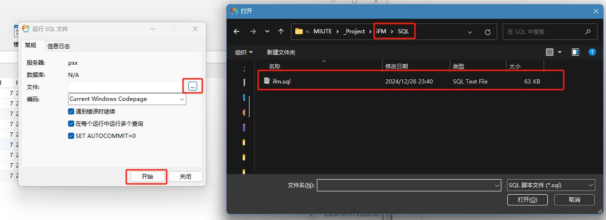
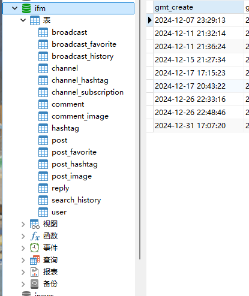
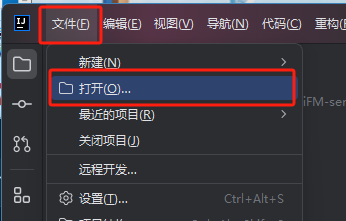
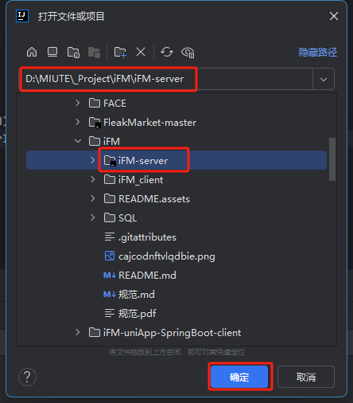
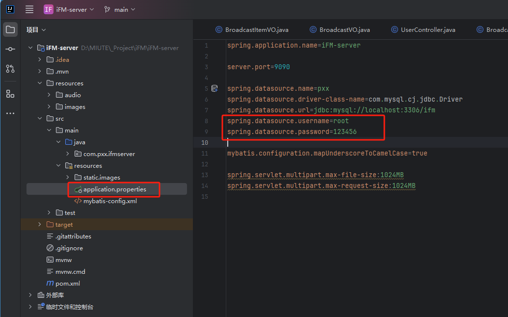
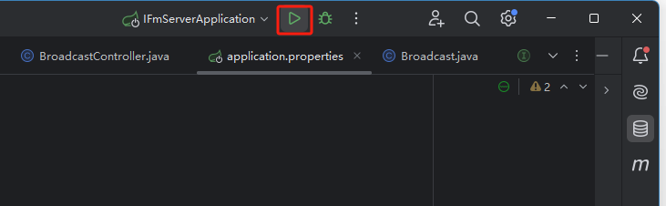
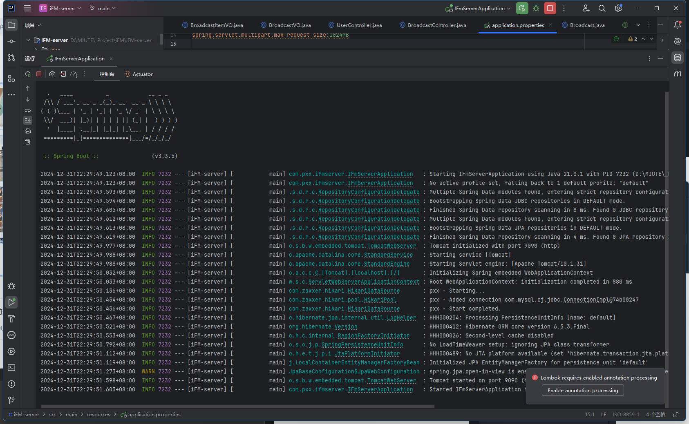
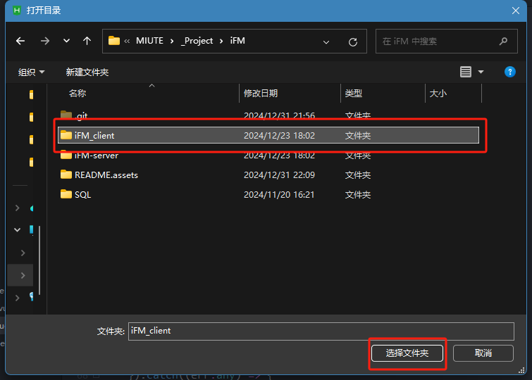
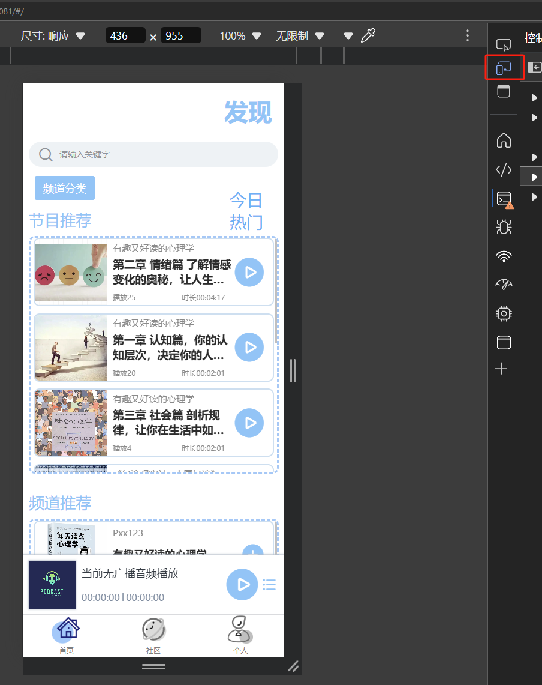

# iFM uniApp+SpringBoot
 播客App 前后端分离移动端项目

**前端:**

uni-app + Vue3 + Typescript + Pinia + Vite

**后端:**

SpringBoot+Maven+MyBatis+MySQL


### 项目运行

**数据库:**

以Navicat为例, 在MySQL连接中, 右键选择运行SQL文件


选择SQL目录下的ifm.sql文件, 点击开始



最终成功导入数据库



**后端:**

以IDEA为例, 点击左上角"文件", 选择打开



选择 iFM-server目录, 点击确定



将数据库配置信息更改为自己的



运行后端



成功



**客户端:**

以HBuilder X为例 ,点击左上角"文件",选择打开目录


选择 iFM_client目录



在iFM_client目录下, 右键选择"在终端中打开"


终端中执行命令:

```cmd
npm install
```

回到HBuilder X, 点击上方"运行", 选择"运行到浏览器", 选择任意浏览器


浏览器中按下"F12", 选择"切换设备仿真"


